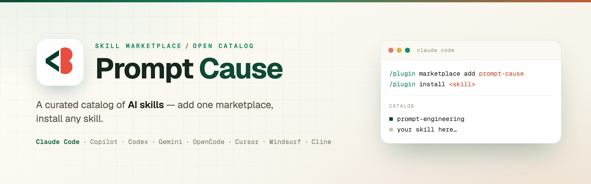

<div align="center">



<br><br>

# Prompt Cause — Skill Marketplace

**A curated catalog of AI skills for Claude Code and other agents.**
Add one marketplace, install any skill.

[](LICENSE)
[](https://github.com/PhAlves23/prompt-cause-marketplace/actions/workflows/validate.yml)
[](#catalog)
[](SECURITY.md)
[](CONTRIBUTING.md)

Works with **Claude Code · GitHub Copilot · OpenAI Codex · Gemini CLI · OpenCode · Cursor · Windsurf · Cline**

</div>

---

## Table of contents

- [What is this](#what-is-this)
- [Quick start](#quick-start)
- [Catalog](#catalog)
- [How it works](#how-it-works)
- [Security model](#security-model)
- [Using skills in other tools](#using-skills-in-other-tools)
- [Contributing a skill](#contributing-a-skill)
- [FAQ](#faq)
- [Repository structure](#repository-structure)
- [Roadmap](#roadmap)
- [License](#license)

---

## What is this

An **AI skill** is a focused capability you can drop into an AI coding agent — a `SKILL.md` plus reference files that teach the agent to do one thing well, and to know *when* to do it.

**Prompt Cause** is a curated marketplace of those skills. Instead of hunting down individual repos and copying files around, you add **one** marketplace and install any skill from a single catalog — with a review-and-pin process that keeps third-party skills safe to run.

Why a marketplace instead of one repo per skill?

- **One source for users.** Add it once; the whole catalog is available.
- **Granular.** Install only the skills you want — nothing is bundled or forced.
- **Open but curated.** Anyone can submit a skill; every listing is reviewed and version-pinned before it ships.

## Quick start

### Claude Code
```
/plugin marketplace add PhAlves23/prompt-cause-marketplace
/plugin install <skill-name>
```
Restart Claude Code, then use the skill (e.g. say "improve this prompt" for `prompt-engineering`).

### GitHub Copilot CLI
```bash
copilot plugin marketplace add PhAlves23/prompt-cause-marketplace
copilot plugin install <skill-name>@prompt-cause
```

> For **Cursor, Windsurf, Codex, Gemini, and OpenCode**, each skill's own repo ships native install instructions — see the [catalog](#catalog) and [Using skills in other tools](#using-skills-in-other-tools).

## Catalog

| Skill | What it does | Category | Repo |
|-------|--------------|----------|------|
| **prompt-engineering** | Rewrites a raw draft into a production-grade prompt, with a changelog of what changed and why. Grounded in primary sources (Anthropic, OpenAI, Google, *The Prompt Report*). | productivity | [prompt-engineering-skill](https://github.com/PhAlves23/prompt-engineering-skill) |

_Want your skill here? See [Contributing](#contributing-a-skill)._

## How it works

Claude Code (and compatible agents) use a three-level hierarchy:

```
Marketplace  →  contains many Plugins  →  each Plugin contains one or more Skills
   (this repo)        (a catalog entry)          (the actual SKILL.md)
```

This repository is the **marketplace**: a catalog defined in [`.claude-plugin/marketplace.json`](.claude-plugin/marketplace.json) that points at skills. A skill can live in one of two places:

| Location | `source` in the catalog | Best for |
|----------|--------------------------|----------|
| **Its own repo** (recommended) | `git-subdir` / `github` / `url`, **pinned to a `sha`** | Skills maintained independently, incl. community ones |
| **Inline** in this repo | `"./plugins/<name>"` | Small skills donated to the catalog |

Either way, users add a single marketplace and install skills individually.

## Security model

Listed skills run **inside other people's agents**, so safety is built into the process — not an afterthought. Three layers:

1. **Review before listing.** Every submission is audited for hidden instructions (prompt injection, data exfiltration, covert tool/URL calls), unsafe scripts, and scope that doesn't match its description.
2. **Pinned commits.** Externally-hosted skills are pinned to a reviewed commit `sha`. A contributor can change their own repo freely, but those changes **do not reach users here** until a new `sha` is reviewed and merged.
3. **Re-review on update + CI enforcement.** Updating a skill is a new PR changing the `sha` (re-audited). The `validate` workflow **rejects** any external source that isn't pinned to a full commit `sha`.

The repo itself is hardened too: least-privilege CI permissions, GitHub Actions pinned by `sha`, `CODEOWNERS` review, and Dependabot. Full policy in [SECURITY.md](SECURITY.md) and [CONTRIBUTING — Versioning & security](CONTRIBUTING.md#versioning--security).

## Using skills in other tools

Skills here target Claude Code first, but the format is portable. Each skill's repo documents its own native install for:

| Tool | Mechanism |
|------|-----------|
| Claude Code / Copilot CLI | This marketplace (`/plugin` or `copilot plugin`) |
| OpenAI Codex | Native skill discovery (`~/.agents/skills`) |
| Gemini CLI | Extension |
| Cursor / Windsurf / Cline | Rules files (`.cursor/rules`, `.windsurf/rules`, `.clinerules`) |
| OpenCode | `AGENTS.md` / skills path |

## Contributing a skill

Community skills are welcome. Two paths:

1. **Keep your skill in your own repo** (recommended) — you own and maintain it; we list it (pinned to a reviewed `sha`).
2. **Contribute it inline** — add it under `plugins/` in this repo.

Start from [`skill-template/`](skill-template/), then follow [CONTRIBUTING.md](CONTRIBUTING.md). Every submission is reviewed for quality and security before listing.

## FAQ

<details>
<summary><b>Is it safe to install skills from here?</b></summary>

Every listing is reviewed and pinned to a specific reviewed commit, so post-review changes in a contributor's repo can't silently reach you. That said, a skill is third-party content — install skills you trust, and review the source repo if in doubt. No marketplace can *guarantee* third-party code is safe; this is defense-in-depth. See [SECURITY.md](SECURITY.md).
</details>

<details>
<summary><b>How do I update a skill I installed?</b></summary>

`/plugin update <skill-name>` (Claude Code) or `copilot plugin update`. You get the latest **reviewed** version — i.e. whatever `sha` is currently merged in this catalog.
</details>

<details>
<summary><b>How do I remove a skill or the marketplace?</b></summary>

`/plugin uninstall <skill-name>` removes a skill. `/plugin marketplace remove prompt-cause` removes the catalog.
</details>

<details>
<summary><b>Can I use these skills outside Claude Code?</b></summary>

Yes — see [Using skills in other tools](#using-skills-in-other-tools). Each skill's repo has native instructions for Cursor, Windsurf, Codex, Gemini, OpenCode, and Cline.
</details>

<details>
<summary><b>I submitted a skill. If I change my repo, do users get the change automatically?</b></summary>

No — and that's by design. Your listing is pinned to the `sha` that was reviewed. To ship an update, open a PR here changing the `sha`; it's re-reviewed before merge. This protects users from unreviewed changes. See [CONTRIBUTING — Versioning & security](CONTRIBUTING.md#versioning--security).
</details>

<details>
<summary><b>What does it cost to run a skill?</b></summary>

Skills are designed to be lean: a small always-on footprint (the description + triggers), with heavier reference material loaded only when the skill actually fires. Check a skill's `details` (`claude plugin details <name>`) for its token cost.
</details>

## Repository structure

```
prompt-cause-marketplace/
├── .claude-plugin/marketplace.json   # the catalog (skills + pinned sources)
├── plugins/                          # inline skills (Path B), if any
├── skill-template/                   # copy this to start a new skill
├── scripts/bump_skill.py             # advance owned skills to their latest sha
├── assets/                           # banner (png + editable html source)
├── docs/ARCHITECTURE.md              # how the catalog, pinning, CI and bump work
├── .github/
│   ├── workflows/validate.yml        # JSON + catalog + sha-pin enforcement
│   ├── workflows/bump-own-skills.yml # opens a PR bumping owned skills
│   ├── ISSUE_TEMPLATE/submit_skill.yml
│   └── CODEOWNERS · dependabot.yml · PULL_REQUEST_TEMPLATE.md
├── CONTRIBUTING.md · SECURITY.md · CODE_OF_CONDUCT.md · CHANGELOG.md · LICENSE
```

## Roadmap

- [ ] Grow the catalog with more first-party and community skills
- [ ] Per-skill category browsing as the catalog grows
- [ ] Automated source-resolves check in CI (verify each pinned `sha` exists upstream)
- [ ] A simple website listing the catalog

Have an idea? Open a [discussion](https://github.com/PhAlves23/prompt-cause-marketplace/discussions).

## License

[MIT](LICENSE) for the catalog and tooling in this repo. Each externally-hosted skill keeps its own license.
